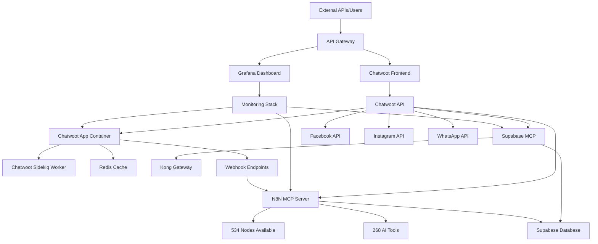

# 🗺️ **MCP SERVICES ARCHITECTURE MAP**
*Mapa de dependencias y flujo de datos*

---

## 🏗️ **ARQUITECTURA DE SERVICIOS**



---

## 📊 **SERVICE DEPENDENCIES MAP**

### **CHATWOOT ECOSYSTEM**
```
chatwoot_chatwoot_app ←→ chatwoot_redis
           ↓
chatwoot_chatwoot_sidekiq
           ↓
[Facebook/Instagram APIs]
           ↓
[Webhook: devevoapi.opemagency.com]
```

### **MCP ECOSYSTEM**
```
N8N MCP (PID: 2511507) ←→ Workflow Engine
           ↓
Supabase MCP Container ←→ Database Layer
           ↓
Kong Gateway (Port: 8000)
```

### **MONITORING LAYER**
```
Grafana Dashboard ←→ Service Metrics
           ↓
Docker Swarm Services
           ↓
Health Checks & Alerts
```

---

## 🔄 **DATA FLOW PATTERNS**

### **1. INBOUND WEBHOOK FLOW**
```
External Service → Chatwoot Webhook → N8N MCP → Processing → Supabase
```

### **2. API INTEGRATION FLOW**
```
Client Request → Chatwoot API → Business Logic → Database → Response
```

### **3. AUTOMATION FLOW**
```
Trigger Event → N8N Workflow → Multiple APIs → Data Processing → Storage
```

---

## 🎯 **CRITICAL INTEGRATION POINTS**

| Integration | Source | Target | Protocol | Auth Method |
|-------------|--------|---------|----------|-------------|
| Chatwoot → N8N | API Webhook | MCP Server | HTTP/POST | Token Auth |
| N8N → Supabase | MCP | Database | HTTP/REST | Service Key |
| Facebook → Chatwoot | Graph API | Inbox | Webhook | App Token |
| Instagram → Chatwoot | Basic Display | Inbox | Webhook | Access Token |
| Grafana → Services | Monitoring | Metrics | Docker API | Internal |

---

## 📍 **PORT MAPPING & NETWORKING**

### **EXTERNAL PORTS**
- **443 (HTTPS):** Chatwoot Frontend, Grafana
- **80 (HTTP):** Redirects to HTTPS

### **INTERNAL PORTS**
- **3000:** Chatwoot App Container
- **6379:** Redis Cache
- **8000:** Supabase Kong Gateway
- **Various:** N8N MCP Internal Communication

### **DOCKER NETWORKS**
- **chatwoot_default:** Main Chatwoot stack
- **monitoring_default:** Grafana stack  
- **supabase_default:** Supabase stack

---

## ⚠️ **FAILURE SCENARIOS & RECOVERY**

### **SINGLE POINT OF FAILURES**
1. **Redis Down:** Chatwoot sessions lost
2. **N8N MCP Down:** Automation stops
3. **Supabase Down:** Data persistence affected
4. **Facebook API:** Social media integration fails

### **RECOVERY PROCEDURES**
```bash
# Chatwoot Stack Recovery
docker service update --force chatwoot_chatwoot_app

# MCP Recovery  
kill -9 2511507 && restart-n8n-mcp.sh

# Supabase Recovery
docker service update --force supabase_kong
```

---

## 🔍 **DEBUGGING PATHS**

### **SERVICE HEALTH CHECK ORDER**
1. **Docker Services:** `docker service ls`
2. **Container Logs:** `docker service logs [service-name]`  
3. **Process Status:** `ps aux | grep [process]`
4. **API Connectivity:** `curl [api-endpoint]`
5. **Database Connection:** MCP function tests

### **TROUBLESHOOTING FLOW**
```
Issue Reported → Check Service Status → Review Logs → Test APIs → Verify Dependencies → Apply Fix
```

---

*📊 Este mapa se actualiza automáticamente cuando hay cambios en la arquitectura*