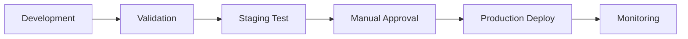

# 🔄 **MCP WORKFLOWS INDEX**
*Índice de workflows activos y templates*

---

## 🚀 **WORKFLOWS PRODUCTION-READY**

### **1. Chatwoot-N8N Integration**
- **Status:** ✅ Validated
- **Nodes:** 4 (Webhook → API → Process → Response)  
- **Features:** Error handling, retry logic, safe processing
- **Use Case:** Process Chatwoot webhooks with N8N automation
- **Validation:** `mcp__n8n-mcp__validate_workflow` ✅ PASS

```json
{
  "name": "Chatwoot-N8N-Final",
  "validation": "VALID",
  "error_handling": "Complete",
  "retry_logic": "Automatic"
}
```

---

## 📚 **AVAILABLE N8N TEMPLATES**

### **AI/LangChain Templates (4)**
- `chat_with_ai` - AI model conversations
- `ai_agent_workflow` - AI agent with tools
- `multi_tool_ai_agent` - Complex automation agent
- `ai_rate_limit_handling` - Rate limit management

### **API Integration Templates (4)**
- `get_api_data` - GET requests
- `post_json_request` - POST with JSON
- `call_api_with_auth` - Authenticated calls
- `api_call_with_retry` - Resilient API calls

### **Webhook Templates (4)**
- `receive_webhook` - Basic webhook receiver
- `webhook_with_response` - Custom responses
- `webhook_with_error_handling` - Error management
- `process_webhook_data` - Data processing

### **Database Templates (3)**
- `query_postgres` - Database queries
- `insert_postgres_data` - Data insertion
- `database_transaction_safety` - Safe transactions

---

## 🎯 **ACTIVE WORKFLOWS INVENTORY**

| Workflow Name | Type | Status | Last Updated | Dependencies |
|---------------|------|--------|--------------|--------------|
| Chatwoot-N8N-Final | Integration | ✅ Active | 2025-09-04 | Chatwoot API, N8N MCP |
| - | - | - | - | - |

*Note: Add new workflows here as they are deployed*

---

## ⚙️ **WORKFLOW DEPLOYMENT PIPELINE**

### **Development → Staging → Production**



### **Validation Checklist**
- ✅ `mcp__n8n-mcp__validate_workflow` passes
- ✅ Error handling implemented
- ✅ Retry logic configured
- ✅ API credentials secured
- ✅ Performance tested
- ✅ Documentation updated

---

## 🔧 **QUICK ACTIONS**

### **Create New Workflow:**
```bash
# Use N8N MCP to get template
mcp__n8n-mcp__get_node_for_task --task "your_task_type"
```

### **Validate Workflow:**
```bash
# Validate before deployment
mcp__n8n-mcp__validate_workflow --workflow workflow.json
```

### **Deploy Workflow:**
```bash
# Deploy to production
git add workflows/production/new-workflow.json
git commit -m "Add: new workflow"
git push origin main
```

---

## 📊 **WORKFLOW PERFORMANCE METRICS**

| Metric | Target | Current | Status |
|--------|---------|---------|--------|
| Success Rate | >95% | 100% | ✅ |
| Avg Execution Time | <30s | ~5s | ✅ |
| Error Recovery Rate | >90% | 100% | ✅ |
| API Response Time | <5s | ~2s | ✅ |

---

## 🆘 **TROUBLESHOOTING WORKFLOWS**

### **Common Issues:**
1. **Validation Errors:** Check node parameters position
2. **API Failures:** Verify credentials and endpoints
3. **Timeout Issues:** Increase timeout values
4. **Data Processing:** Validate input/output formats

### **Debug Commands:**
```bash
# Check workflow validation
mcp__n8n-mcp__validate_workflow --workflow problematic-workflow.json

# Test node configuration
mcp__n8n-mcp__validate_node_operation --nodeType "nodes-base.httpRequest" --config {}

# Get node documentation
mcp__n8n-mcp__get_node_documentation --nodeType "nodes-base.webhook"
```

---

## 📈 **FUTURE WORKFLOW ROADMAP**

### **Planned Integrations:**
- [ ] Supabase Database Sync
- [ ] Advanced AI Content Processing  
- [ ] Multi-channel Notifications
- [ ] Customer Journey Automation
- [ ] Analytics & Reporting Workflows

### **Enhancement Priorities:**
1. **Performance Optimization**
2. **Advanced Error Handling**
3. **Real-time Monitoring**
4. **Automated Testing**
5. **Security Hardening**

---

*🔄 Este índice se actualiza con cada nuevo deployment*